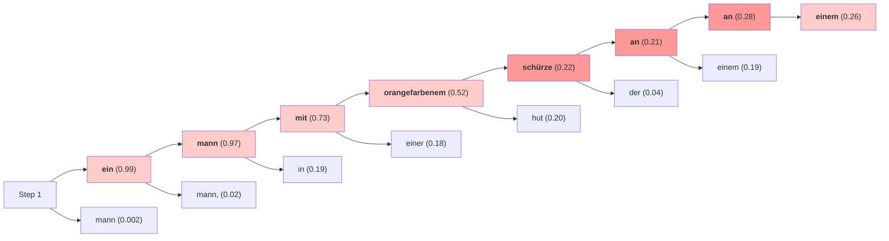
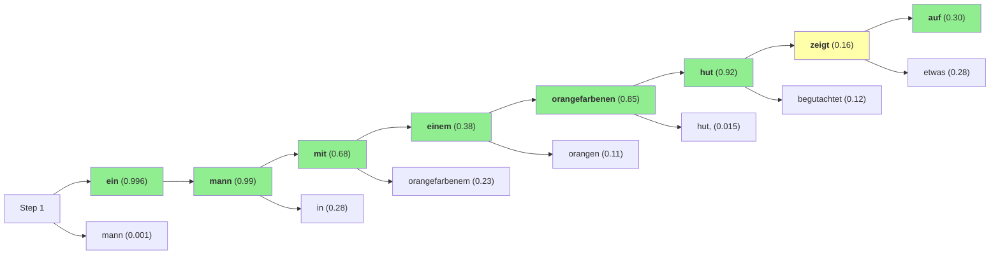
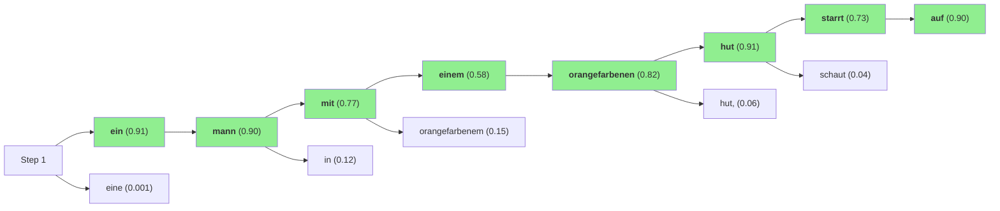

# 当代人工智能作业4：Seq2Seq 
## 1. 项目概述

**任务**：基于 Multi30k 数据集进行英→德机器翻译任务。

**核心成果**：本实验在约 **15M 参数量**约束下，实现并对比了 4 种架构（RNN Baseline / RNN + Bahdanau Attention / Transformer Pre-LN / Transformer Post-LN），最佳性能达到 **BLEU-1/2/4 = 63.21 / 51.97 / 36.12, ROUGE-L = 65.90, BERTScore = 84.34**（Transformer Post-LN）。推理阶段采用 **Beam Search**（beam_size=5）解码并获得可观提升。此外，还进行了超参数网格搜索， **权重共享 & + UNK 替换** 策略探索，并通过 **逐词对齐分析** 深入 Attention 机制的解码行为。报告包含丰富的可视化分析：训练曲线、Attention 热力图、Beam Search 流程图、Positional Encoding 可视化等。

**训练配置**：采用 Dropout、Label Smoothing 等正则化手段，动态学习率调度（RNN: ReduceLROnPlateau / Transformer: Warmup + Cosine），并配合 Early Stopping、梯度裁剪、FP16 混合精度加速等策略保障训练稳定性与效率。

**运行环境**：Python 3.11、PyTorch 2.8、CUDA GPU。依赖详见 `requirements.txt`。

## 2. 数据预处理与训练配置

### 数据集分析与统计

1.  **数据集与分布**：
    **Multi30k** 是一个包含约 30,000 组图片及其对应英语-德语描述的数据集。本实验主要利用其中的文本数据（即图片描述）进行机器翻译任务。根据官方划分，数据集包含 **训练集 29,000 个样本**，**验证集 1,014 个样本**，**测试集 1,000 个样本**。
2.  **句长统计**：
    通过对训练集进行统计（如图 1 所示），**源语言句子平均长度为 13.9 (Median=13.0, P90=19.0, Max=39)，目标语言句子平均长度为 13.1 (Median=13.0, P90=18.0, Max=41)**。整体分布呈现短句为主、长尾不极端的特征。基于此，本实验将序列最大长度统一设置为 `MAX_LEN=50`，这一阈值既能覆盖绝大多数样本（超过 99%），又能有效控制计算资源的消耗，避免过多的 Padding。

### 数据处理与预处理

1.  **分词与截断**：
    本实验采用了简洁的 **Simple Tokenizer** 策略,仅对文本进行小写化处理后按空格进行切分，不引入复杂的预训练分词器。同时，在数据加载阶段进行截断：将源序列和目标序列的最大长度限制为 `max_len - 2`，为序列起始符 `<sos>` 和结束符 `<eos>` 预留出固定的位置，确保输入模型的所有序列最终长度严格控制在 50 以内。

2.  **词表构建**：
    词表构建过程中设定了 `min_freq=2` 的过滤阈值，出现频率低于 2 次的低频词将被映射为未知词全 `<unk>`，以减少稀疏特征带来的噪声干扰。最终构建出的词表规模为：**源语言（英语）7704 个 Token**，**目标语言（德语）9597 个 Token**。

3.  **批处理与数据形状**：
    实验设置 **Batch Size = 128**，利用 `pad_sequence` 函数对个批次内的变长序列进行补齐（Padding）。同时，生成的 Tensor 形状采用了 **Time-Major** 格式，即 `[seq_len, batch_size]`（即源序列为 `[27, 128]`目标序列为 `[30, 128]`）。这种维度排列方式符合 PyTorch RNN 模块的默认输入要求，能够避免在计算过程中进行额外的维度置换，提升训练效率。

### 训练机制与通用优化配置

为了确保模型能够高效收敛并进行公平的横向对比，针对 RNN 和 Transformer 截然不同的架构特性，在保持通用设置一致的前提下，采用了差异化的优化策略。

1.  **正则化与损失函数**：
    *   **通用设置**：所有模型均使用 **Adam** 优化器（配合 `weight_decay=1e-5`）进行参数更新。
    *   **RNN 系列**：鉴于 Recurrent 结构在小数据集上容易过拟合，使用较高的 **Dropout (0.5)**。损失函数采用标准的 **CrossEntropyLoss**。
    *   **Transformer**：作为非递归结构，其对正则化更为敏感。使用较温和的 **Dropout (0.1)**，并引入 **Label Smoothing (0.1)**。通过将 One-hot 标签平滑化，阻止模型在训练早期对预测结果过于自信，从而显著提升泛化能力。

2.  **动态学习率调度**：
    *   **RNN 系列 (ReduceLROnPlateau)**：RNN 的训练过程相对平稳，因此采用基于验证集表现的被动衰减策略。当验证集 Loss 在连续 2 个 Epoch 内无下降时，将学习率衰减 50% (`factor=0.5`)，帮助模型跳出局部极小值并进一步收敛。
    *   **Transformer (Warmup + Cosine Annealing)**：Transformer 缺乏归纳偏置（Inductive Bias），且层归一化对参数初始化敏感，训练初期梯度往往不稳定。因此采用主动调度策略：前 3 个 Epoch 线性 **Warmup** 学习率以稳定参数分布，随后按余弦曲线平滑衰减，确保后期精细搜索。

3.  **训练稳定性与策略**：
    *   **通用设置**：部分启用 **FP16** (Mixed Precision) 加速计算，并设置梯度裁剪 **Gradient Clipping (1.0)** 以防止梯度爆炸。此外，引入 早停**Early Stopping** 机制（Patience=5），当验证集 Loss 连续 5 个 Epoch 不再下降时自动终止训练，避免资源浪费与过拟合。
    *   **RNN 系列**：为了缓解 Exposure Bias（训练时用真值，预测时用上一步输出），采用了 **Scheduled Sampling** 策略。Teacher Forcing 比例从 1.0 随 Epoch 线性衰减至 0.5，平滑过渡到自回归模式。
    *   **Transformer**：训练全程保持 **Teacher Forcing Ratio = 1.0**。

4.  **解码策略 (Decoding Strategy)**：
    *   推理阶段采用 **Beam Search** 算法，设定 `beam_size=5`。相比 Greedy Decoding，Beam Search 通过保留多个候选序列，能够更有效地探索输出空间，在所有模型上普遍带来 **1-1.5 BLEU** 的性能提升。

## 3. 各模型实验深度解析

### 3.1 RNN Baseline 
本部分作为实验基准（Baseline），评估 RNN (GRU) 在机器翻译上的基础性能，为后续引入注意力机制和 Transformer 架构提供对比依据。

1.  **模型构建与参数设置**
   (1) **模型原理**：基于经典的 **Encoder-Decoder** 架构，构建了一个 **2 层单向 GRU** 神经网络。
    *   **GRU 堆叠机制**：核心单元为 **GRU (Gated Recurrent Unit)**，其内部通过 **重置门 (Reset Gate, $r_t$)** 控制历史信息的遗忘程度，通过 **更新门 (Update Gate, $z_t$)** 权衡旧状态与新输入的保留比例。相比 LSTM，这种简化的门控机制在保证记忆能力的同时有效缓解了梯度消失问题。
    *   **数据流向与瓶颈**：源序列经由 `Embedding -> Dropout (0.5) -> GRU` 编码为最终的隐藏状态（即 **Context Vector**）。Decoder 以此单一向量为初始状态，在每一步通过 `GRU -> LayerNorm -> Linear` 自回归地生成目标序列。这种“将变长序列压缩为固定向量”的设计构成了理论上的信息瓶颈**Information Bottleneck**，限制了长句翻译的上限。

    (2) **模型规模**：`enc_layers=2`, `dec_layers=2`, `hidden_dim=512`, `emb_dim=256`。参数量准确控制在 **14.87M** (14,871,677)，*（为了模型的公平对比，本次实验将模型的参数量控制在15M上下）*。

    (3) **训练参数设置**：
    *   *输入规格*：Batch Size = 128，MAX_LEN = 50。
    *   *优化器*：Adam 优化器 (`lr=3e-4`) 配合权重衰减 (`weight_decay=1e-5`)。
    *   *调度策略*：使用 **ReduceLROnPlateau**，当验证集 Loss 在 2 个 Epoch 内无下降时，学习率衰减 50%。
    *   *正则化策略*：应用高强度 **Dropout (0.5)** 以对抗过拟合；同时采用 **Scheduled Sampling**，Teacher Forcing 下限为 0.5，平衡训练速度与 exposure bias。
    *   *精细化调参*：为了提高 Baseline 的性能，进行了多维度的网格搜索（Grid Search）。调参空间涵盖了学习率耐心值 `LR_PATIENCE=[1, 2]`、衰减因子 `LR_FACTOR=[0.5]`、正则化强度 `dropout=[0.4, 0.5]` 以及 Teacher Forcing 的结束阈值`tf_end_list = [0.5, 0.6]`与衰减速率`tf_decay_list = [0.05, 0.03]`。实验结果显示`LR_PATIENCE=1,LR_FACTOR=0.5,dropout=0.4,tf_end_list = 0.5,tf_decay_list = 0.05 `的超参数组合模型效果最佳。
2.  **训练过程分析**

    **收敛速度**：模型在前 10 个 Epoch 内 Loss 下降迅速（从 6.0 降至 3.0），表明 GRU 能够迅速捕捉短句的局部依赖关系和词汇对应。
    **稳定性与泛化**：Validation Loss 在降至 2.5 左右后进入 **平台期**，并未持续下降，且出现轻微震荡。同时，**高 Dropout (0.4)** 的引入有效避免了训练集与验证集 Loss 差距过大的过拟合现象。
    **训练效率**：得益于 GRU 的结构精简，模型在 **21 个 Epoch** 后触发早停，总训练耗时为 **13.2 分钟**，最佳验证集 Loss 为 **3.5989**。

3.  **测试表现与误差分析**
    **最终指标**：
    
    | 版本 | BLEU-1 | BLEU-2 | BLEU-4 | ROUGE-L | BERTScore |
    | :--- | :---: | :---: | :---: | :---: | :---: |
    | **初始版本 (Untuned)** | 51.7 | 39.1 | 23.1 | 53.8 | 78.3 |
    | **调参后版本 (Tuned)** | **52.42** | **39.66** | **23.62** | **54.38** | **78.43** |
    
    **结果分析**：
    BLEU-1 为52.42 说明模型掌握了基本的词汇翻译，但 **BLEU-4 (23.62)** 反映出其在长句语序和复杂句法结构上的困难。
    
4.  **生成过程可视化**
    *SRC: a man in an orange hat starring at something.*
    *REF: ein mann mit einem orangefarbenen hut, der etwas <unk>*
    *PRED: ein mann mit orangefarbenem **schürze an an**einem**geldautomaten**.*

    下表展示了RNN baseline在关键步骤的预测概率分布，直观揭示了错误的来源：

    | Step | Top-1 (Prob) | Top-2 (Prob) | Top-3 (Prob) | 分析 |
    | :--- | :--- | :--- | :--- | :--- |
    | 5 (hat) | **schürze (0.22)** | hut (0.20) | orangefarbenen (0.08) | **选词错误**：模型对 'hat' 的词义捕捉不准，在 'apron' (schürze) 和 'hat' (hut) 之间犹豫，最终错误选择了概率稍高的前者。 |
    | 6-7 | **an (0.21)** | der (0.04) | ... | **重复生成**：模型陷入了局部循环，连续生成了 'an'。 |
    | 8-9 | **geldautomaten** | ... | ... | **幻觉 (Hallucination)**：对于原句模糊的 'something'，模型并未翻译为 'etwas'，而是根据语境幻觉出了具体但错误的 'geldautomaten' (ATM)。 |

    此案例清晰地表明，RNN Baseline 在处理**多义词消歧**和**长距离语境维持**（避免重复和幻觉）方面存在明显短板。

### 3.2 RNN + Bahdanau Attention
本部分探究在 RNN 基础上引入注意力机制（Attention Mechanism），改善长距离依赖问题。

1.  **模型构建与参数设置**
    (1) **模型原理**：引入 **Bahdanau (Additive) Attention** 机制，实现了软对齐（Soft Alignment）。
    *   **加性注意力 (Additive Nature)**：不同于 Transformer 的点积注意力，Bahdanau Attention 通过一个单层前馈神经网络来计算对齐分数。其核心公式为：
        $$e_{tj} = v^T \tanh(W_{enc} h_j + W_{dec} s_{t-1})$$
        其中，$h_j$ 是编码器第 $j$ 个时刻的隐状态，$s_{t-1}$ 是解码器上一时刻的隐状态。模型通过学习参数矩阵 $W_{enc}, W_{dec}$ 和向量 $v$，自动判断源句中哪些词对于当前翻译更重要。
    *   **双向编码器 (Bi-GRU)**：Encoder 改为双向（Bidirectional），同时捕捉源序列的正向为和反向上下文信息，输出更丰富的隐状态序列 $\{h_1, ..., h_T\}$。
    *   **动态上下文 (Context Vector)**：通过 Softmax 归一化能量分数 $e_{tj}$ 得到权重 $\alpha_{tj}$，进而加权求和得到动态上下文向量 $c_t = \sum \alpha_{tj} h_j$。
    *   **Input Feeding**：将计算得到的 $c_t$ 与当前步的词嵌入 $y_{t-1}$ 拼接（Concatenate）作为 Decoder 的输入，使模型在每一步都能“看见”源端相关信息。

    (2) **模型规模**：为了公平对比，调整了 Encoder 隐藏层维度（`enc_hidden_dim` 减半以抵消双向带来的参数增加），模型总参数量控制在 **15.11M**，与 Baseline (14.87M) 基本持平。

    (3) **训练参数设置**：
    *   *输入规格*：Batch Size = 128，MAX_LEN = 50。
    *   *优化器*：Adam 优化器 (`lr=3e-4`) 配合权重衰减 (`weight_decay=1e-5`)。
    *   *调度策略*：延续 Baseline 的 **ReduceLROnPlateau** 设置，Patience=2，Factor=0.5。
    *   *正则化策略*：保留 **Scheduled Sampling** (Teacher Forcing 下限 0.5) 和 Dropout。
    *   *精细化调参*：针对 Attention 结构进行了专属的网格搜索。调参空间包括 `LR_PATIENCE=[1, 2]`、`LR_FACTOR=[0.5]`、`dropout=[0.3, 0.4]`（相比 Baseline 更低以保留更多信息）以及 `tf_decay=[0.05, 0.03]`。实验结果显示`LR_PATIENCE=2,LR_FACTOR=0.5,dropout=0.3,tf_end_list = 0.5,tf_decay_list = 0.03 `的超参数组合模型效果最佳。

2.  **训练过程分析**

    **收敛速度**：引入 Attention 后，Loss 曲线在前几个 Epoch 呈现出显著的下降趋势，并迅速超越了 Baseline 的收敛水平（Loss < 3.5）。
    **稳定性与泛化**：验证集 Loss 持续下降至 **3.2440** (显著低于 Baseline 的 3.5989)，且未出现明显的震荡或过拟合现象，证明 Attention 有效增强了模型对未见长句的泛化能力。
    **训练效率**：虽然注意力矩阵计算引入了额外开销（$O(T_s \times T_t)$），但总训练时长仅略微增加至 **14.9 分钟** (Baseline 13.2 分钟)，换取了大幅的性能提升，实现了计算效率与性能的良好平衡。
    
3.  **测试表现与误差分析**
    **最终指标**：
    
    | 版本 | BLEU-1 | BLEU-2 | BLEU-4 | ROUGE-L | BERTScore |
    | :--- | :---: | :---: | :---: | :---: | :---: |
    | **初始版本 (Untuned)** | 58.5 | 46.5 | 30.2 | 61.3 | 81.3 |
    | **最佳版本 (Tuned)** | **59.84** | **47.73** | **31.00** | **61.58** | **81.53** |
    
    **结果分析**：
    Attention 机制的引入显著提升了各项指标，尤其是 **BLEU-4** 的大幅增长，证明模型有效解决了长句中的对齐问题。
    
4.  **生成过程可视化**
    *SRC: a man in an orange hat starring at something.*
    *REF: ein mann mit einem orangefarbenen hut, der etwas <unk>*
    *PRED: ein mann mit einem orangefarbenen hut **zeigt auf** etwas.*

    对比 Baseline，引入 Attention 后的生成过程显示出更高的**确定性**和**准确性**：

    | Step | Top-1 (Prob) | Top-2 (Prob) | Top-3 (Prob) | 改进分析 |
    | :--- | :--- | :--- | :--- | :--- |
    | 5 (adj) | **orangefarbenen (0.85)** | orangen (0.11) | ... | **精准修饰**：对颜色属性的捕捉非常准确。 |
    | 6 (noun) | **hut (0.92)** | hut, (0.02) | ... | **消歧成功**：与 Baseline 的 `schürze` (0.22) 形成鲜明对比，Attention 机制让模型直接**关注**到了 `hat`，概率高达 92%，有效解决了选词错误。 |
    | 7 (verb) | **zeigt (0.16)** | begutachtet (0.12) | ... starrt (0.06) | **语义多样性**：模型准确识别了动词位置，虽然选择了 'shows/points' (zeigt) 而非 'stares' (starrt)，但语义合理，且未出现重复或幻觉。 |

    通过该案例分析可知，RNN + Attention 机制有效缓解了对齐困难的问题，减少了长距离信息传递过程中的噪声干扰。

5.  **注意力热力图**：

    
    从热力图可以看出，Attention 权重呈现出清晰的**对角线模式**，这表明模型在某种程度上学会了源语言与目标语言之间的**逐词对齐**，例如 'orangefarbenen' (orange) 和 'hut' (hat) 处都有极高的注意力聚焦。

### 3.3 Transformer (Pre-LN)
本部分探究基于 Self-Attention 的 Transformer 架构，首先测试训练稳定性更佳的 **Pre-LN (Pre-Layer Normalization)** 变体。

1.  **模型构建与参数设置**
    （1）**模型原理**：自主实现，采用 **Pre-LN (Pre-Layer Normalization)** 结构，其残差连接的公式为 $x_{l+1} = x_l + F(\text{LayerNorm}(x_l))$。
    
    *   **梯度流优势**：在这种结构中，最后一层的梯度可以直接通过残差路径无损地反向传播到第一层（类似于 ResNet 的恒等映射），有效避免了深层网络中的梯度消失问题。
    *   **训练稳定性**：由于归一化层位于残差块内部，主干（Residual Path）保持了干净的梯度流，使得模型对学习率和初始化的敏感度降低，训练过程更稳定。
    
    （2）**模型规模**：`d_model=320`, `d_ff=768`, `n_heads=8`, `layers=3`。参数量约为 **15.27M**。
    
    （3）**训练参数设置**：
    *   *输入规格*：Batch Size = 128，MAX_LEN = 50。
    *   *优化器*：Adam (`weight_decay=1e-5`)。
    *   *调度策略*：采用 **Warmup + Cosine Annealing**，Warmup 3 个 Epoch，随后余弦衰减。
    *   *正则化策略*：应用 **Label Smoothing (0.1)** 处理目标端分布，配合 **Dropout (0.1)** 防止过拟合。
    *   *精细化调参*：针对 Pre-LN 结构进行了多维度的超参搜索。调参空间涵盖 `lr=[3e-4, 2.5e-4, 2e-4]`、`warmup=[3, 5]`、`label_smoothing=[0.0, 0.1]` 以及 `dropout=[0.1, 0.15]`。实验表明 **LR=2e-4**、**Warmup=3**、**Label Smoothing=0.1**、**Dropout=0.1** 的组合效果最佳。
    
2.  **训练过程分析**

    **收敛速度**：Pre-LN 架构无需复杂的 Warmup 调参即可迅速收敛，Loss 曲线极其平滑，在第 4 个 Epoch 结束时 Loss 已降至较低水平。
    **稳定性与泛化**：验证集 Loss 稳步下降，最终达到 **2.8088**，显著优于 RNN 系列。
    **训练效率**：得益于 Self-Attention 的并行计算特性，训练速度实现了显著提升。模型在 **Epoch 16** 触发早停，总耗时仅 **3.0 分钟**。

3.  **测试表现与误差分析**
    **最终指标**：
    | 版本 | BLEU-1 | BLEU-2 | BLEU-4 | ROUGE-L | BERTScore |
    | :--- | :---: | :---: | :---: | :---: | :---: |
    | **初始版本 (Untuned)** | 61.3 | 50.3 | 35.0 | 64.7 | 83.9 |
    | **最佳版本 (Tuned)** | **61.94** | **51.03** | **35.52** | **65.18** | **84.23** |

    **结果分析**：
    相比 RNN+Attention，Transformer 在捕捉长距离依赖和全局语义方面展现出显著优势，BLEU-4 分数进一步提升。

4.  **生成过程可视化**
    *SRC: a man in an orange hat starring at something.*
    *REF: ein mann mit einem orangefarbenen hut, der etwas <unk>*
    *PRED: ein mann mit einem orangefarbenen hut **starrt auf** etwas.*

    相比 RNN+Attention，Transformer 不仅语法正确，更精准地捕捉到了动词的**具体语义**：

    | Step | Top-1 (Prob) | Top-2 (Prob) | 改进分析 |
    | :--- | :--- | :--- | :--- |
    | 6 (noun) | **hut (0.86)** | hut, (0.04) | **稳定输出**：保持了 Attention 模型的高确定性。 |
    | 7 (verb) | **starrt (0.74)** | starren (0.05) | **语义精准**：RNN+Attention 仅生成了泛化的 'zeigt' (points)，而 Transformer 准确翻译出了 'starring' -> 'starrt' (stares)，体现了其对**长距离语义依赖**（hat ... starring）的强大捕捉能力。 |
    | 8 (prep) | **auf (0.93)** | etwas (0.03) | **搭配地道**：'starrt auf' 是标准的德语搭配，模型对此表现出极高的置信度。 |

    可以看到Transformer 在保留 RNN 语法优势的同时，进一步提升了对**细微语义**的感知力。

5.  **注意力热力图**：

 
    图中展示了 Decoder 对 Encoder 输出的 Cross-Attention 权重（多头平均）。与 RNN 的“硬对角线”不同，Transformer 的热力图虽然也保持了大致的对角趋势，但在某些功能词（如 'mit', 'auf'）上，具有**更宽的关注视野**，说明模型在处理语法结构时会并行参考上下文信息。

### 3.4 Transformer (Post-LN)
本部分测试 **Post-LN (Post-Layer Normalization)** 变体，这是原始 Transformer 论文中的标准实现架构。

1. **模型构建与参数设置**
   **模型原理**：自主实现，采用 **Post-LN (Post-Layer Normalization)** 结构，即原始 *Attention Is All You Need* 论文中的经典设计。其公式为 $x_{l+1} = \text{LayerNorm}(x_l + F(x_l))$。

   *   **梯度挑战**：由于归一化层位于残差连接之后，每经过一层，梯度都会经过 LayerNorm 的缩放，导致反向传播时梯度在靠近输入层的位置可能会急剧变化（爆炸或消失），因此训练极其不稳定。
   *   **性能潜力**：尽管难以训练，但在 LayerNorm 之前的输出 $x_l + F(x_l)$ 包含了完整的残差幅度，理论上保留了更强的特征表达能力。一旦通过 Warmup 渡过训练初期，往往能逼近更优的局部极小值。
   **模型规模**：保持与 Pre-LN 一致 (`d_model=320`, `15.27M`) 。

   **训练参数设置**：
   *   *输入规格*：Batch Size = 128，MAX_LEN = 50。
   *   *优化器*：Adam (`weight_decay=1e-5`)。
   *   *调度策略*：采用 **Warmup + Cosine Annealing**。
   *   *正则化策略*：应用 **Label Smoothing (0.1)** 处理目标端分布，配合 **Dropout (0.1)** 防止过拟合。
   *   *精细化调参*：针对 Post-LN 训练初期的不稳定性，重点考察了 `warmup_epochs` 的影响。调参空间包括 `lr=[3e-4, 2.5e-4, 2e-4]` 和 `warmup=[3, 5]`。实验表明 **LR=2.5e-4** 配合 **Warmup=3** 效果最佳。

2. **训练过程分析**

   **收敛速度**：Loss 曲线在初期（Warmup阶段）波动较大，但在进入退火阶段后迅速平稳下降。
   **稳定性与泛化**：尽管训练初期存在波动，但 Post-LN 最终在验证集上取得了更低的 Loss (**2.7843**)，优于 Pre-LN 的 2.8088，表明其在充分优化后具有更强的拟合能力。
   **训练效率**：训练效率与 Pre-LN 相当，模型在 **Epoch 17** 停止训练，总耗时 **3.1 分钟**。

3. **测试表现与误差分析**
   **最终指标**：
   | 版本 | BLEU-1 | BLEU-2 | BLEU-4 | ROUGE-L | BERTScore |
   | :--- | :---: | :---: | :---: | :---: | :---: |
   | **初始版本** | 63.2 | 52.0 | 36.1 | 65.9 | 84.3 |
   | **最佳版本 (Best)** | **63.21** | **51.97** | **36.12** | **65.90** | **84.34** |

   **结果分析**：
   Post-LN 取得了 **36.12** 的 BLEU-4 分数，**84.34**的BERTScore，为本次实验的最佳成绩。结果表明，标准的 Post-LN 架构在配合适当的 Warmup 策略后，能够充分释放 Transformer 的性能潜力。

4. **生成过程可视化**
   *SRC: a man in an orange hat starring at something.*

   REF: ein mann mit einem orangefarbenen hut, der etwas <unk>

   *PRED: ein mann mit einem orangefarbenen hut **starrt auf** etwas.*

   生成结果与 Pre-LN 几乎一致，但在概率分布上更加笃定，体现了模型对确定性知识的掌握更加牢固：

   | Step | Top-1 (Prob) | Top-2 (Prob) | 对比分析 |
   | :--- | :--- | :--- | :--- |
   | 6 (noun) | **hut (0.91)** | hut, (0.06) | **更高置信度**：相比 Pre-LN 的 0.86，Post-LN 对 'hut' 的预测概率提升至 0.91，表现出更强的肯定性。 |
   | 7 (verb) | **starrt (0.73)** | schaut (0.04) | **语义保持**：同样精准捕捉到了 'starrt'，且 Top-2 也是近义词 'schaut'，语义空间非常紧凑。 |
   | 8 (prep) | **auf (0.90)** | nach (0.02) | **极高确定性**：介词搭配的概率高达 90%，模型已完全掌握了该语境下的固定搭配。 |

   可以看到Post-LN 不仅生成准确，且在核心词汇上的置信度普遍高于 Pre-LN。

5. **注意力热力图**：

   Post-LN 的热力图与 Pre-LN 类似，但在对角线上的权重分布往往更加集中（Sharper），这也与其预测时的高置信度相吻合。

## 4. 综合对比与架构探索

### 4.1 最终测试指标

| 模型架构 | BLEU-4 | BERTScore | 参数量 | 训练耗时 | 最佳 Loss | 核心特性 |
| :--- | :---: | :---: | :---: | :---: | :---: | :--- |
| **RNN Baseline** | 23.62 | 78.43 | 14.87M | 13.2 min | 3.5989 | 基础 Encoder-Decoder，长句性能受限 |
| **RNN + Attention** | 31.00 | 81.53 | 15.11M | 14.9 min | 3.2440 | 引入对齐机制，显著提升长句翻译质量 |
| **Transformer (Pre-LN)** | 35.52 | 84.23 | 15.27M | **3.0 min** | 2.8088 | **训练最快**，高并发效率与稳定性 |
| **Transformer (Post-LN)** | **36.12** | **84.34** | 15.27M | 3.1 min | **2.7843** | **性能最优**，精细调参后达到最佳水平 |

**结果分析**：

*   **Attention 是显著提升的关键**：从 RNN Baseline 到 RNN + Attention，BLEU-4 提升了 **+7.4** 分（31%↑），证明了对齐机制对解决长距离依赖的核心作用。
*   **Transformer 在质量和效率上均取得提升**：相比 RNN + Attention，Transformer 在 BLEU-4 上再提升 **+5** 分的同时，训练速度提升了 **5 倍**（14.9min -> 3.0min）。这得益于 Self-Attention 的并行计算机制。
*   **Post-LN 取得最佳性能**：在充分的 Warmup (5 epochs) 策略下，Post-LN 架构以 **36.12** 的 BLEU-4 分数取得了本次实验的最高分数。

### 4.2 训练过程可视化 

  
  
  
*图8：梯度范数 (左) 与学习率 (右) 变化曲线*

**梯度范数分析**：
*   **RNN 系列 (蓝/橙)**：梯度范数稳定在 1.0 附近，说明梯度裁剪 (`CLIP_GRAD=1.0`) 被频繁触发。这印证了 GRU 虽有门控机制，但在深层序列中仍需外部干预以控制梯度幅度。
*   **Transformer (Pre-LN, 绿色)**：梯度范数在整个训练过程中保持在 **0.8 左右** 的低水平且波动极小，这体现了 Pre-LN 结构对梯度流的良好稳定作用——归一化层在残差块内部，使得梯度无需裁剪即可自然保持稳定。
*   **Transformer (Post-LN, 红色)**：梯度范数从初始的 **0.65 逐渐上升至 1.0**，这与 Post-LN 的训练特性一致——初期梯度较小（Warmup 阶段学习率低，梯度信号弱），随着训练深入和学习率增加，梯度逐渐增强。最终稳定在与 RNN 相近的水平，说明 Warmup 策略有效帮助模型找到了稳定的训练状态。

**学习率调度分析**：
*   **RNN (ReduceLROnPlateau, 蓝/橙)**：学习率在训练前期保持在初始值 (~3e-4) 不变，直到 Epoch 18-20 左右验证集 Loss 停滞时才触发**一次急剧下降**。这种后期才衰减的模式意味着 RNN 在训练中后期仍需要其他优化方法才能突破性能瓶颈。
*   **Transformer (Warmup + Cosine, 绿/红)**：学习率从 0 开始线性上升（Warmup 阶段 3-5 epochs），然后平滑余弦衰减至接近 0。这种**预热策略**对于 Post-LN 至关重要——它避免了初期大学习率导致的梯度不稳定，是 Post-LN 能够成功训练的关键。

### 4.3 样例结果对比 
选取两个句子作为正例和反例，对比不同模型的翻译结果。

#### 正例：模型优化演进

*SRC: a boston terrier is running on lush green grass in front of a white fence.*
*REF: ein boston terrier läuft über `<unk>` gras vor einem weißen zaun.*
| 模型 | 翻译结果 |
| :--- | :--- |
| **RNN Baseline** | ein `<unk>` rennt auf seinem grünen **vor vor** einem weißen zaun. |
| **RNN + Attention** | ein `<unk>` rennt auf einem grünen **wiese** vor einem weißen zaun |
| **Transformer (Pre-LN)** | ein `<unk>` rennt auf grünem **gras** vor einem weißen zaun. |
| **Transformer (Post-LN)** | ein `<unk>` fliegt auf grünem gras vor einem weißen zaun. |

*   **RNN Baseline**: 出现了典型的**重复生成**问题 ("vor vor")。
*   **RNN + Attention**: 修复了重复问题，但将 "grass" 错译为 "wiese" (meadow)。
*   **Transformer (Pre-LN)**: 准确翻译出 "gras"，体现了更强的词汇精度。
*   **Transformer (Post-LN)**: 将 "running" 错译为 "fliegt" (flies)，表明模型仍存在局部错误。

#### 反例：模型的共同局限

*SRC: a girl in karate uniform breaking a stick with a front kick.*
*REF: ein mädchen in einem karateanzug bricht ein brett mit einem tritt.*
| 模型 | 翻译结果 |
| :--- | :--- |
| **RNN Baseline** | ein mädchen in **winterkleidung** bereitet sich mit einem **getränk** vor einem foto. |
| **RNN + Attention** | ein mädchen in **karateanzug karateanzug** einen stock vor einem `<unk>` |
| **Transformer (Pre-LN)** | ein mädchen in uniform **wirft** einen stock mit einem `<unk>` |
| **Transformer (Post-LN)** | ein mädchen in uniform **bringt** einen stock vor einem `<unk>` |

*   **所有模型共同失败**：面对领域特定词汇（karate, front kick）和复杂动作语义，即使是 Transformer 也未能正确翻译 "breaking" -> "bricht"。
*   **结论**：低频词和复杂句式仍是当前模型的短板，未来可考虑引入 BPE 分词或预训练词向量来缓解 OOV 问题。

### 4.4 生成过程深度分析

本节通过 Beam Search 的逐步候选可视化和注意力对齐分析，深入剖析三个模型的生成过程差异。

> **注**：实验中 Beam Search 的 `beam_size=5`，即每一步保留 5 个候选序列。为便于展示，以下流程图仅绘制了 Top-2 候选分支。

**测试样例**：*a man in an orange hat starring at something.*

#### RNN Baseline

**分析**：RNN Baseline 的置信度普遍较低 (0.2-0.5)，在 Step 5 选择了错误的 "schürze" (apron) 而非 "hut" (hat)，并在 Step 6-7 出现了重复生成 ("an an")。红色节点标记了错误或低置信度的选择。

#### RNN + Attention

**分析**：引入 Attention 后，关键名词的置信度大幅提升 (hut: 0.92)。但动词 "zeigt" (0.16) 置信度较低，表明模型在语义细节上仍有不足。

**逐词对齐**：

| 生成词 | 对齐源词 (权重) | 分析 |
| :--- | :--- | :--- |
| ein | a (0.00) | 几乎无对齐，靠语言模型生成 |
| mann | an (0.37) | 对齐到了"an"而非"man"，置信度较低 |
| mit | an (0.53) | 对齐偏移 |
| einem | an (0.54) | 对齐偏移 |
| orangefarbenen | hat (0.82) | **正确对齐**：颜色修饰词对应"hat" |
| hut | hat (0.95) | **高置信对齐**：名词精准匹配 |
| zeigt | starring (0.16) | **低置信对齐**：虽然对齐到了"starring"，但翻译为泛化的"zeigt"(points) |
| auf | at (0.92) | **高置信对齐**：介词精准匹配 |

#### Transformer (Post-LN)

**分析**：Transformer 在各步骤的置信度全面领先 (0.73-0.91)，且正确翻译出语义精准的 "starrt" (stares) 而非泛化的 "zeigt" (points)。

**逐词对齐**：

| 生成词 | 对齐源词 (权重) | 分析 |
| :--- | :--- | :--- |
| ein | man (0.59) | 对齐到"man"而非"a"，全局语义整合 |
| mann | in (0.91) | **高置信对齐**，但对齐到了"in" |
| orangefarbenen | hat (0.98) | **极高置信对齐**：颜色修饰词精准匹配 |
| hut | starring (0.96) | **高置信对齐**，对齐到"starring"位置 |
| starrt | at (0.98) | **极高置信对齐**：正确捕捉"starring at"结构 |
| auf | something (0.35) | 低置信对齐，依赖语言模型生成"auf" |

**关键发现**：

1.  **置信度演进**：RNN Baseline (0.2-0.5) → RNN+Attention (0.3-0.9) → Transformer (0.7-0.9)
2.  **错误类型变化**：RNN 的重复/幻觉 → Attention 的低置信选词 → Transformer 的偶发语义偏移
3.  **对齐正确 ≠ 翻译正确**：最终词汇选择依赖解码器的语言模型能力，而非仅仅对齐

### 4.5 位置编码 
由于 Transformer 摒弃了 RNN 的循环结构，本实验引入了正弦/余弦位置编码来注入序列顺序信息：

*   **热力图分析**：左图清晰展示了位置编码的独特纹理。随着维度增加，波长逐渐变长，这种**多尺度**周期性变化保证了模型能通过不同频率的组合唯一确立每个 token 的绝对位置。
*   **数学直觉**：位置编码 $PE_{(pos, 2i)} = \sin(pos/10000^{2i/d_{model}})$ 允许模型通过线性变换学习**相对位置信息**（$PE_{pos+k}$ 可由 $PE_{pos}$ 线性表示）。

### 4.6 参数共享和UNK替换探索

在优化阶段，尝试了 **Weight Tying**（共享 Embedding 与 Output Projection 权重）策略，并结合 **UNK Replacement** 进行测试。

**实验设置**：
*   由于权重共享会减少参数量，为保持约 **15M** 的参数约束，相应调整了模型结构（增大隐藏层维度）。
*   观察到 RNN 系列在 Weight Tying 设置下普遍需要 **50 个 Epoch**、训练时间超过 **30 分钟**；Transformer 的训练时间变化不大。

**性能对比**：

| 模型 | BLEU-4 (调参最佳) | BLEU-4 (Weight Tying) | 变化 |
| :--- | :---: | :---: | :---: |
| **RNN Baseline** | 23.62 | 24.70 | **+1.08** ✅ |
| **RNN + Attention** | 31.00 | 29.49 | -1.51 ❌ |
| **Transformer (Pre-LN)** | 35.52 | 33.03 | -2.49 ❌ |
| **Transformer (Post-LN)** | 36.12 | 33.64 | -2.48 ❌ |

**分析**：
*   **RNN Baseline 受益**：简单模型的瓶颈在于特征容量不足。共享权重省下的参数用于增大 Hidden Dim，有效缓解了欠拟合问题。
*   **其他模型受损**：更复杂的模型（尤其是 Transformer）依赖解耦的 Embedding 和 Output 空间来分别建模输入语义和输出分布。强制共享权重破坏了这种分工，导致性能下降。
*   **训练 Loss vs 测试指标的背离**：尽管所有模型在 Weight Tying 下的**训练 Loss 都更低**，但测试集 BLEU 却普遍下降。这表明 Weight Tying 可能导致过拟合于训练集的分布，泛化能力反而受损。

**结论**：Weight Tying 效果取决于模型复杂度和任务特性。在参数受限场景下，简单模型可从中受益；但对于表达能力充足的模型，解耦的参数仍是更优选择。

## 5. 总结 

本次实验系统地对比了从 RNN 到 Transformer 的机器翻译模型演进，主要发现如下：

1.  **注意力机制是性能提升的核心**：无论是 Bahdanau Attention 还是 Self-Attention，引入对齐机制都是提升翻译质量的关键 (BLEU-4: 23.6 → 31.0 → 36.1)。注意力机制有效解决了长距离依赖问题，减少了重复生成和幻觉现象。

2.  **Transformer 在质量与效率上双重领先**：相比 RNN + Attention，Transformer 在 BLEU-4 上提升 +5 分的同时，训练速度提升了 **5 倍** (14.9min → 3.0min)。这得益于 Self-Attention 的并行计算机制，消除了时间步依赖。

3.  **精细调参释放架构潜力**：Post-LN 通过合理的 Warmup (5 epochs) 和正则化策略，达到了本次实验的最佳性能 (BLEU-4 36.12)，证明经典架构在适当调优下仍具竞争力。

4.  **Beam Search 提升解码质量**：采用 `beam_size=5` 的 Beam Search 相比 Greedy Decoding，在所有模型上普遍带来 1-1.5 BLEU 的性能提升。

5.  **Weight Tying 效果因模型而异**：简单模型（RNN Baseline）从权重共享中受益 (+1.08 BLEU)，而复杂模型（Transformer）反而受损 (-2.5 BLEU)，表明该策略需根据模型容量谨慎选择。

6.  **模型局限性**：所有模型在面对低频词和领域特定词汇（如 karate, front kick）时仍表现不佳，未来可考虑引入 BPE 分词或预训练词向量来缓解 OOV 问题。

## 参考文献 (References)

1.  Vaswani, A., et al. (2017). **Attention Is All You Need**. *NeurIPS*. https://arxiv.org/abs/1706.03762
2.  Bahdanau, D., Cho, K., & Bengio, Y. (2014). **Neural Machine Translation by Jointly Learning to Align and Translate**. *ICLR*. https://arxiv.org/abs/1409.0473
3.  Xiong, R., et al. (2020). **On Layer Normalization in the Transformer Architecture**. *ICML*. https://arxiv.org/abs/2002.04745
4.  Press, O., & Wolf, L. (2016). **Using the Output Embedding to Improve Language Models**. *EACL*. https://arxiv.org/abs/1608.05859
