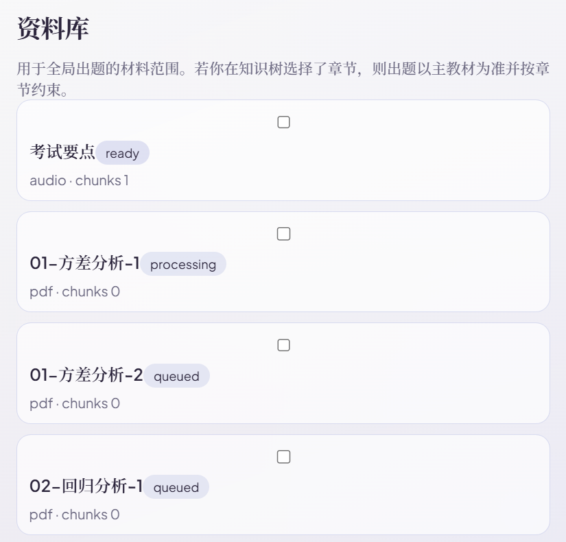
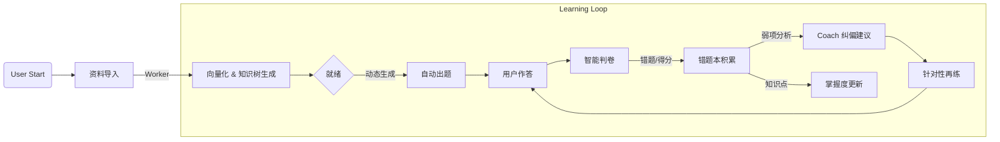
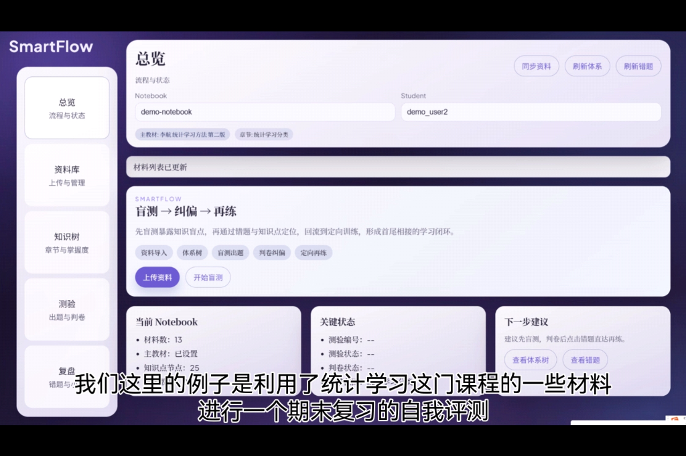
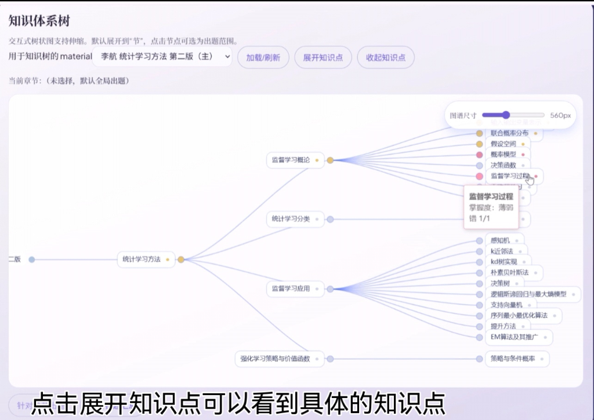
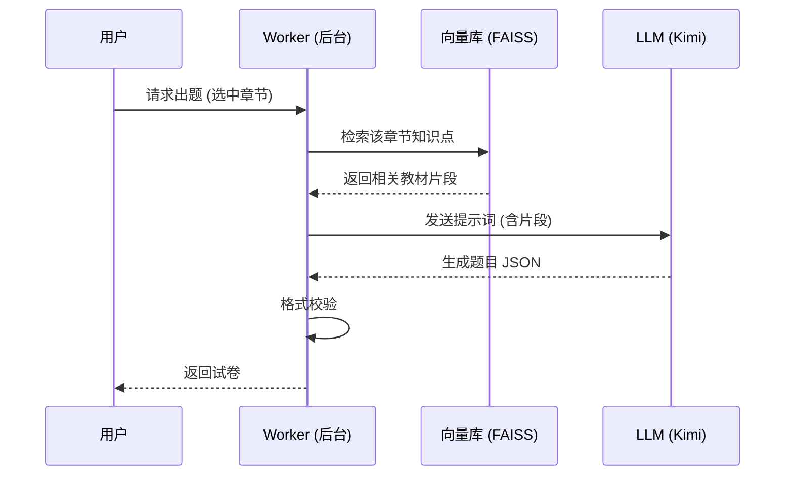
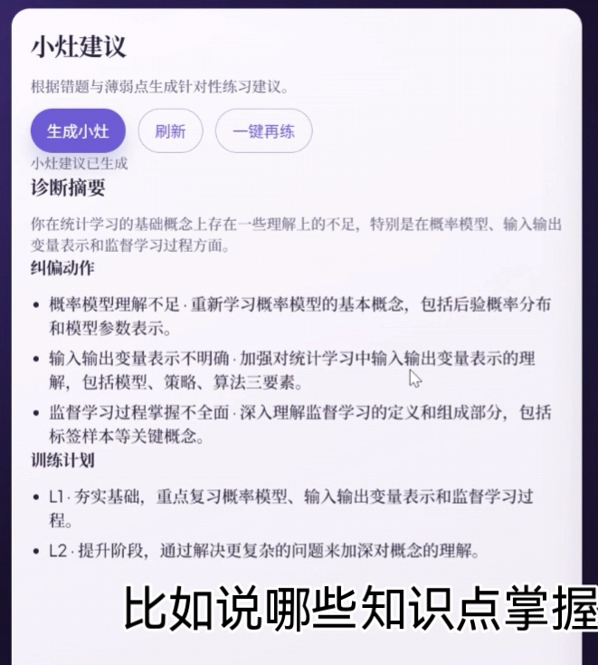
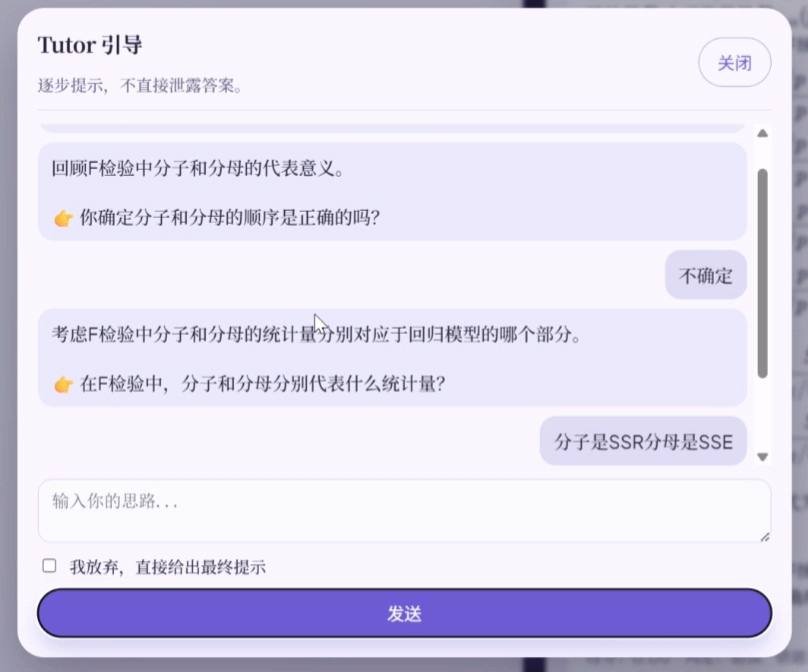
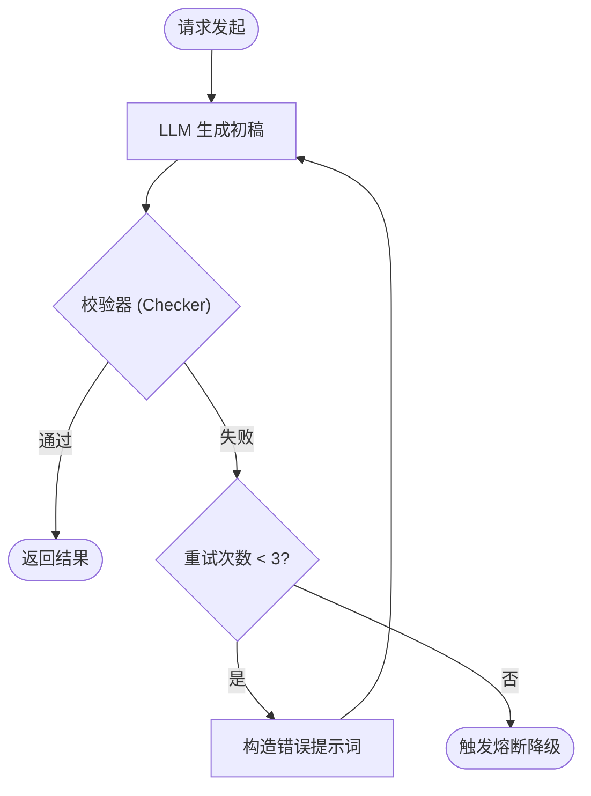

# 智能体云原生学习评测系统（SmartFlow）技术报告

## 1. 摘要
本项目面向“学习效果评估与巩固”场景，解决学完新知识后缺乏客观评估、难以定位薄弱点的问题。**系统以“资料导入→自动出题→智能判卷→错题与掌握度回流→再练与引导”为闭环**，结合 LLM Agent 与 Check Layer，实现可用、可解释的学习评测流程。工程上采用云原生方式拆分为**API/Worker/数据库/队列等服务**，通过 **Docker Compose** 统一编排，并使用 **MongoDB 与 Redis** 实现持久化记忆与异步任务。在多模态输入（PDF/DOCX/音频转写）的基础上，系统生成题目与解析、记录错题并提供 Tutor 引导和 Coach 纠偏建议，最终形成“评测—纠偏—巩固”的学习闭环。

## 2. 核心痛点与需求分析

### 2.1 痛点场景定义
在学习者完成新知识的初步摄入后，往往面临三大痛点，导致知识内化效率低：
1.  **"评估缺失"**：缺少即时、客观的检测手段，学习者难以确认自己是否真正掌握了知识点。
2.  **"盲点隐形"**：错误往往被忽略，无法像考试一样暴露知识盲区，导致复习缺乏针对性。
3.  **"纠偏滞后"**：缺乏类似助教的角色提供实时反馈，错题难以转化为深度理解，无法形成闭环。

### 2.2 系统目标
本项目旨在构建 **SmartFlow 智能体云原生评测系统**，实现 **"学-测-判-纠-练"** 的全链路闭环。
*   **输入多样化**：支持 PDF 教材、DOCX 笔记及课程录音（ASR 转写）作为知识源。
*   **评估智能化**：利用 LLM 根据资料动态生成不同难度的题目（选择/填空/简答），并提供基于知识点的深度解析。
*   **反馈个性化**：自动聚合用户的薄弱知识点，形成动态"错题本"生成小灶建议，并由 AI Coach 生成针对性的复习计划。

### 2.3 亮点与扩展功能 (Beyond Requirements)
相较于基础的大作业要求，本系统在以下方面进行了功能扩展与深度优化：
1.  **知识体系可视化**：不局限于单次出题，而是自动从资料中抽取“章-节-点”树状结构，并以 ECharts 可视化展示，支持按章节定向测验。
2.  **动态掌握度画像**：建立了红/黄/绿三色掌握度模型，根据做题结果实时更新知识点状态，直观暴露薄弱环节。
3.  **Tutor & Coach 双重辅助**：
    *   **Tutor（助教）**：在做题时提供苏格拉底式引导（过程式引导），而非直接给出答案。
    *   **Coach（教练）**：在课后基于错题历史生成针对性的复习计划（小灶建议）。
4.  **鲁棒的 Check Layer**：构建了独立的校验层，不仅检测 LLM 输出格式，还能进行自动重试与修复，显著提升了系统的稳定性。

## 3. 系统架构设计（云原生）

本系统采用经典的微服务架构，完全基于云原生理念构建。系统充分利用 Docker 容器化技术实现了组件的解耦与环境一致性，并**支持本地运行与云端部署（如 ECS）**，保证服务可迁移与易扩展。

### 3.1 架构图


架构图从宏观到微观展示了系统运行的全貌，主要分为四个核心板块：
1.  **Cloud Infrastructure (云基础设施)**：底层采用云服务器（ECS）作为计算载体，提供弹性的 CPU/Memory 资源与网络环境。
2.  **Docker Container Cluster (容器集群)**：核心业务逻辑运行于 Docker 容器中，包含 Frontend、Backend、Worker、Redis 及 MongoDB，通过 Docker Compose 进行统一编排与网络隔离。
3.  **External AI Services (外部 AI 服务)**：系统通过 API 网关调用外部模型能力（Kimi Chat, Groq, Zhipu AI），实现 ASR、LLM 推理与 Embedding 生成。
4.  **Data Flow (核心数据流)**：如图示，箭头清晰标注了“用户请求 $\rightarrow$ 任务入队 $\rightarrow$ 异步推理 $\rightarrow$ 结果持久化”的全链路数据流向。

### 3.2 容器集群组件详情 (Docker Cluster Components)
对应架构图中的 **Section 2: Docker Container Cluster**，系统核心通过 `docker-compose.yml` 编排了 5 个松耦合容器。下表结合代码实现详细说明各组件职责：

| Docker Service | 源码路径 (Source Path) | 技术栈 (Stack) | 核心职责 (Responsibility) |
| :--- | :--- | :--- | :--- |
| **backend** | `/backend` | FastAPI, Pydantic | **无状态网关**。负责路由分发 (`app/api`) 与请求参数校验。它不处理重逻辑，而是将任务封装为 `Job` 推送至 Redis。 |
| **worker** | `/worker` | RQ (Redis Queue) | **异步计算节点**。监听 `default` 队列，消费耗时任务（如 `tasks/rag.py` 向量检索、`tasks/grade_attempt.py` 判卷），实现计算与 I/O 分离。 |
| **redis** | (Image: redis:7) | Redis | **消息总线**。作为 Broker 存储 RQ 任务队列，支撑异步任务流转。 |
| **mongodb** | (Image: mongo:6) | MongoDB | **持久化存储**。Schemaless 存储试卷 JSON (`quizzes`)、错题聚合 (`mistakes`) 及知识树结构，适应多变的 AI 生成内容。 |
| **frontend** | `/frontend` | React, Vite, ECharts | **交互界面**。通过 Axios 与后端通信，利用 ECharts 渲染动态知识图谱，通过 Polling 机制查询异步任务进度。 |

### 3.3 关键技术链路机制 (Key Technical Mechanisms)
为支撑上述复杂的业务闭环，系统在底层实现了三类核心技术链路：

1.  **Event-Driven Async Pipeline (基于事件的异步处理)**:
    *   **机制**: API 接收请求后仅生成 `Task ID` 并立即返回，Payload 被序列化后推入 Redis `default` 队列。Worker 按队列消费任务。
    *   **优势**: 彻底解耦了高并发的 Web 请求与高耗时的 LLM 推理，防止 http_timeout。
    
    
    *上图展示了 Frontend 实时轮询 Redis/Database 获取的任务生命周期状态：*
    *   **Queued (排队中)**: 任务 Payload 已序列化写入 Redis List，等待 Worker 领取（如图中 `01-方差分析-2`）。
    *   **Processing (处理中)**: RQ Worker 已将其 Pop 出队列，正在执行 ETL 清洗或 Embedding 向量化（如图中 `01-方差分析-1`）。
    *   **Ready (就绪)**: 任务执行完毕，知识树与索引构建完成，回调函数已更新 MongoDB 状态，可用于出题（如图中 `考试要点`）。

2.  **Document Processing Lifecycle (文档生命周期)**:
    *   **Raw**: 原始文件流被存储至 Docker Volume (`/app/storage/uploads`)。
    *   **Vector**: 经切分后的 Chunks 被向量化（向量维度由模型决定），并构建为本地 FAISS 索引文件 (`.index`) 持久化，供 RAG 检索。
    
3.  **Hybrid Persistence Strategy (混合持久化)**:
    *   **Hot Data**: 任务队列与短期状态由 Redis 承载，用于异步调度与状态传递。
    *   **Cold Data**: 试卷结构、错题记录等业务数据存入 MongoDB，利用 JSON Document 特性灵活适应 Prompt 输出的字段变化。

## 4. 业务流程与功能闭环

### 4.1 功能闭环流程图


如图所示，系统核心并不是线性的任务流，而是**一个“以评促学”的闭环系统 (Closed-Loop System)**。
*   **启动层**: 用户导入资料后，系统后台自动完成向量化与知识结构化，进入“就绪”状态。
*   **循环层 (Learning Loop)**: 用户的每一次作答 (UserDo) 并非终点，而是新一轮学习的起点。错题数据 (Mistake) 被实时回流至 Coach Agent，触发个性化的“纠偏”与“再练”，直至知识掌握度 (Mastery) 达标。


*上图为 SmartFlow 系统的核心工作台，通过可视化流程引导用户完成“盲测—纠偏—再练”的完整闭环。示例中演示了对《统计学习方法》课程的期末复习自测流程。*

### 4.2 资料导入与知识库构建 (Automated Ingestion)
**借鉴 Google NotebookLM 的产品理念，本系统以 "Notebook"（笔记本）作为知识管理的最小单元。** 用户可围绕特定专题（如“统计方法”、“操作系统”）创建 Notebook，并在其下聚合管理多个相关的 PDF/DOCX/音频文件，实现跨文档的综合学习。

在此基础上，系统支持多模态非结构化数据的“一键入库”，自动完成 ETL 处理与知识抽取。

*   **多格式支持**:
    *   **PDF/DOCX**: 调用 **Moonshot AI (Kimi) File Extract API** 进行高保真文本解析，保留文档结构与段落语义。
    *   **Audio (MP3)**: 集成 **Groq Whisper API**，将课程录音/会议记录快速转写为文本，识别错误率 < 5%。
*   **知识处理流水线**:
    1.  **Chunking**: 按语义段落 + 滑动窗口（Size=512, Overlap=50）进行切分，保证上下文连续性。
    2.  **Vectorization**: 调用 **Zhipu AI** Embedding 模型将文本块转化为 1024 维向量，构建局部 FAISS 索引。
    3.  **Topic Modeling**: 利用 LLM 递归总结各 Chunk 的核心主题，生成**结构化的“章-节-点”知识体系树 (Knowledge Tree)**，作为后续可视化的数据基础。


*上图展示了动态生成的知识体系树，不同颜色代表了用户对该知识点的掌握程度（绿=熟练，红=薄弱），点击节点即可查看具体的知识点详情并进行针对性训练。*

### 4.3 双模式出题策略 (Dual-Mode Quiz Generation)
系统摒弃了静态题库，支持两种动态测试模式以适应不同学习阶段：

*   **Mode A: 全局扫盲测试 (Global Scanning)**:
    *   **场景**: 初始阶段或考前摸底。
    *   **逻辑**: Worker 随机抽取全文档的 5-10 个 Key Chunks，生成覆盖面广的混合题型（选择+简答），快速定位知识盲区。
*   **Mode B: 局部章节精练 (Local Drill)**:
    *   **场景**: 用户在复习时，可直接在 **“知识体系树” (Knowledge Tree)** 上勾选特定章节或知识点节点。
    *   **逻辑**: 系统根据用户选定的 Node ID，反向索引检索关联的 Context Chunks，进行针对性出题，实现“哪里不会点哪里”的精准突破。



### 4.4 智能判卷逻辑 (Hybrid Grading)
针对不同题型采用分级策略，兼顾准确率与成本：
*   **客观题 (Rule-based + Re-check)**: 
    *   优先进行关键词/选项正则匹配（完全命中即满分）。
    *   若匹配失败（如大小写/同义词），触发 **LLM Semantic Check** 辅助判断，降低误判率。
*   **主观题 (Rubric-based Evaluation)**:
    *   LLM 扮演“阅卷老师”，依据 `Correctness` (0.4), `Completeness` (0.3), `Reasoning` (0.2), `Clarity` (0.1) 多维评分标准打分，并给出扣分原因。

### 4.5 错题回流与掌握度闭环 (The Feedback Loop)
#### 4.5.1 错题本 (Mistake Book)
自动聚合错误题目，记录 `error_tag`（如“概念混淆、计算错误”），支持按标签筛选复习。

#### 4.5.2 掌握度画像 (Mastery Heatmap)
基于 ECharts 构建红/黄/绿三色知识树：
*   **Red**: 错误率 > 60%
*   **Yellow**: 错误率 30%-60%
*   **Green**: 错误率 < 30%

#### 4.5.3 Coach 智能诊断 (Remedial Plan)
Coach Agent 不仅识别错题，更深入分析错误背后的认知缺陷（如“概率模型理解不足”）。它会根据红色薄弱节点，动态生成分阶段的补救建议：
*   **L1 夯实基础**: 推送相关的定义回忆与简单例题。
*   **L2 能力提升**: 推送跨章节的综合应用题。


*Coach Agent 生成的个性化诊断详情，指出学生在“概率模型”和“输入输出变量”方面的理解偏差，并给出针对性训练计划。*

#### 4.5.4 AI 助教答疑 (Tutor Dialogue)
在错题页面，用户可随时唤起 **Tutor Agent**。不同于直接给出答案，Tutor 会采用**苏格拉底式提问**（Process-Oriented Guided Inquiry），一步步引导用户自己思考出正确解法，真正实现“授人以渔”。


*Tutor 拒绝直接给出答案，而是通过连续追问（如“分子分母分别代表什么？”）引导用户自己发现逻辑漏洞。*

## 5. 智能体设计与工程实现 (Agent Design & Engineering)

### 5.1 Agent 列表 (Agent Inventory)
系统通过多智能体协作实现复杂的教学逻辑，核心 Agent 及其职责如下：
1.  **Quiz Agent (出题)**: `backend/app/agents/quiz_generator.py`，负责生成结构化试题。
2.  **Grade Agent (判卷)**: `worker/tasks/grade_attempt.py`，负责客观题判定与主观题多维评分。
3.  **Coach Agent (小灶建议)**: `backend/app/agents/coach.py`，基于错题历史生成复习计划。
4.  **Tutor Agent (引导式对话)**: `backend/app/tutor_runtime/engine.py`，负责苏格拉底式答疑。

### 5.2 LLM 工程化范式 (LLM Engineering Patterns)
本系统基于**轻量自研的 RAG 流水线**与 **Prometheus** 提示词方法论，构建了稳定的 AI 交互层；同时预留与 LangChain 等框架的对接能力。

#### 1. 编排层：轻量 RAG Pipeline
系统核心 RAG 流水线由自研模块实现（切分、向量化、召回与拼接），并基于本地 FAISS 索引完成检索。该设计减少依赖，部署更轻量，且便于后续接入 LangChain 等框架。

#### 2. 提示层：Prometheus Prompting
在 Prompt 设计上，我们遵循 **Prometheus** 原则（Role-Task-Criteria-Input-Output），特别是强调 **评分量表 (Rubric)** 的显式定义。

以下展示均来自 `backend` 源码的**真实 Prompt 片段**（经简化）。

#### (1) Quiz Generator (JSON 结构化生成)
强制 LLM 输出严格的 JSON 数组，包含 `knowledge_points` 用于后续知识图谱挂载。
```python
# Source: backend/app/agents/quiz_generator.py
prompt = (
    "基于以下学习资料，生成测验题目。只输出 JSON 数组，不要输出任何解释。\n"
    "数组长度严格等于 num_questions。\n"
    "每个元素字段：\n"
    "- type: mcq/blank/short\n"
    "- stem: 题干\n"
    "- options: 仅当 type=mcq 时提供，形如 [\"A ...\",\"B ...\",...]\n"
    "- answer_key: mcq 填 \"A\"/\"B\"/...；blank/short 给参考答案文本\n"
    "- rubric: 简答/填空评分要点\n"
    "- difficulty: L1/L2/L3\n"
    "- knowledge_points: 字符串数组（2-5个）\n"
    "- analysis: 解析\n\n"
    f"学习资料：\n{text}\n"
)
```

#### (2) Grade Agent (Prometheus-Style Rubric Evaluation)
采用 **Prometheus 提示词工程** 方法，为 LLM 提供清晰的“评分量表 (Rubric)”及 RAG 上下文。
```python
# Source: worker/tasks/grade_attempt.py
prompt = (
    "Grade the student's short answer based on the rubric and reference answer.\n"
    "Use criteria_scores with keys: correctness, completeness, reasoning, clarity (0-1).\n"
    "Final score = 0.4*correctness + 0.3*completeness + 0.2*reasoning + 0.1*clarity.\n"
    "Return JSON with fields: criteria_scores, score (0-1), verdict, is_correct, "
    "missing_points, error_tags, error_analysis, feedback.\n"
    "missing_points MUST be knowledge-point oriented.\n"
    f"Context:\n{rag_context}\n"  # <--- RAG Retrievals
    f"Rubric: {rubric}\n"          # <--- Prometheus Criteria
    f"Student answer: {answer}\n"
)
```

#### (3) Tutor Agent (提示阶梯状态机)
核心创新点。Tutor 不是一个简单的 Chatbot，而是一个带有 **Hint Ladder (L0->L1->L2)** 状态的有限自动机。Prompt 动态感知当前所处层级。
```python
# Source: backend/app/tutor_runtime/engine.py
ladder_rules = {
    "L0": "指出可能忽略的条件/定义，不给答案；用1个提示+1个反问引导...",
    "L1": "给一个关键概念提示，并让学生用自己的话复述/应用...",
    "L2": "给一步推导/一步判断（只一步）...",
    "FINAL": "学生明确放弃或轮次超限：给完整讲解和最终答案...",
}
prompt = (
    "你是学生的引导式导师(Tutor)。你的任务是‘一轮只给一步’，使用提示阶梯(Hint ladder)。\n"
    "严格要求：\n"
    "- hint_level != FINAL 时，禁止出现‘正确答案’等任何泄露内容。\n"
    "- 必须引用学生的作答或关键词。\n"
    f"本轮 hint_level = {hint_level}\n"
    f"本轮规则：{ladder_rules[hint_level]}\n"
)
```

### 5.3 工具链与模型 (Toolchain & Models)
系统针对不同任务场景，选用了最优的技术栈组合：

1.  **Moonshot AI (Kimi 8k)**:
    *   **职责**: 核心逻辑推理。包括 PDF/DOCX 文本抽取、出题生成、判卷评分、知识树构建。
    *   **优势**: 极强的指令遵循能力（Instruction Following）和长文本处理能力（200k context 支持大文档阅读）。
2.  **Groq (Whisper-large-v3)**:
    *   **职责**: 语音转写 (ASR)。
    *   **优势**: 利用 LPU 推理加速，实现接近实时的音频转文本体验。
3.  **Embedding API (ZhipuGLM-4 + FAISS)**:
    *   **职责**: 向量化与 RAG 检索。
    *   **机制**: 调用 Zhipu Embedding 生成 1024 维向量，本地 FAISS 只做索引存储，兼顾了效果与隐私（数据不出域）。


## 6. 幻觉控制与公平性 (Check Layer)
本章节阐述系统如何通过中间件设计，解决 LLM 输出不可控与评分主观性问题。

### 6.1 输出校验机制 (Output Validation)
系统为每个 Agent 实现了专属的 Checker 类（继承自 `BaseChecker`），对 LLM 输出进行针对性拦截：
*   **QuizCheck**: 强制校验 JSON 格式及必需字段（`stem`, `options`），防止生成残缺题目。
*   **GradeCheck**: 验证评分逻辑的自洽性，确保 `criteria_scores` 加权和等于总分。
*   **CoachCheck / TutorCheck**: 审查输出是否包含违规答案泄露，确保“引导而非代答”。

### 6.2 失败重试与降级策略 (Retry & Fallback)
基于 `run_with_checker` 装饰器，实现了类似 **ReAct** 的自省修复循环：
1.  **Draft**: LLM 生成初稿。
2.  **Validate**: Checker 校验。若失败，将错误堆栈注入 Prompt 请求重写。
3.  **Circuit Breaker (熔断)**: 若 3 次重试仍未通过，触发降级：
    *   **出题降级**: 返回提示信息或减少题量，避免流程中断。
    *   **判卷降级**: 先给出规则判断或提示稍后重试，避免误判。




### 6.3 判卷公平性保障 (Grading Fairness)
为了消除 AI 评分的随机性，我们针对不同题型设计了多层次的公平性约束：
*   **客观题 (0/1 Logic)**:
    *   采用严格的规则判定，选择题正确即 1 分、错误即 0 分。
    *   对于语义等价/格式差异（如大小写），可进行必要的归一化处理。
*   **主观题 (Prometheus Scoring)**:
    *   引入 **Prometheus 提示词工程**，强制 LLM 进行“角色扮演”与“分项打分”。
    *   **Rubric 约束**: 如果学生答案未命中 `rubric` 中的得分点，即使文笔再好也不给分，杜绝“辛苦分”。

## 7. 数据模型与持久化设计 (Data Model)

系统采用 **MongoDB** 存储核心业务数据，利用其 Schema-less 特性灵活应对 LLM 输出结构的多变性（如试题字段的不定长）。

### 7.1 核心集合设计 (Core Collections)
数据库表结构按照业务领域划分为三大类：

#### (1) 资料与知识库 (Knowledge Base)
*   **materials**: 存储文件元数据（Filename, Size, Status）。
*   **material_texts**: 存储分块后的文本数据。
    *   `chunks`: 数组结构，存储切分后的 Text Chunks，用于 RAG 检索。
*   **knowledge_nodes**: 存储生成的知识树节点结构（Chapter/Section/Point）。

#### (2) 测验与评估 (Assessment)
*   **quizzes**: 试卷元数据（Mode, Difficulty），充当 Questions 的容器。
*   **questions**: 题目库。
    *   存储 `stem`, `options`, `rubric`, `rag_context` 等字段。
*   **attempts**: 用户作答记录。
    *   存储用户的原始输入 `student_answer` 及判卷结果 `feedback`。

#### (3) 反馈闭环 (Feedback Loop)
*   **mistakes**: 错题本。
    *   聚合存储 `error_tags` 和 `error_analysis`，支持按知识点查询高频错误。
*   **mastery**: 掌握度模型。
    *   以 `(student_id, node_id)` 为联合主键，记录每个知识点的 `correct_count` / `wrong_count`，动态计算掌握率颜色。

### 7.2 Notebook 与用户隔离 (Data Isolation)
为了支持多租户（Multi-User）及多专题（Multi-Topic）学习，系统在数据层实现了严格的逻辑隔离：

1.  **Notebook 隔离**:
    *   所有业务数据（Materials, Quizzes, Mistakes）均强制包含 `notebook_id` 字段。
    *   场景：用户学习“操作系统”时，不会检索到“计算机网络”Notebook 下的题目或资料。
2.  **用户隔离**:
    *   所有交互数据（Attempts, Mastery, Tutor Sessions）均强制包含 `student_id` 字段。
    *   虽然系统共享同一套 RAG 向量库（Hot Chunk），但用户的学习进度与错题记录完全私有，互不干扰。

## 8. 环境配置与部署 (Configuration & Deployment)

### 8.1 Dockerfile 与 Compose
系统完全容器化，通过 `docker-compose.yml` 编排了 5 个核心服务：
*   **backend**: FastAPI 服务，暴露 8000 端口。
*   **worker**: RQ Worker，负责异步处理 Embedding、知识树生成等耗时任务。
*   **frontend**: Vite + React 服务，暴露 5173 端口。
*   **mongodb**: 数据持久化。
*   **redis**: 任务队列中间件。

容器构建策略：
*   **Frontend**: 开发阶段由 Vite 提供本地服务；生产可切换为 Nginx 托管静态资源。
*   **Backend/Worker**: 共享 Python 基础镜像，通过 `entrypoint` 区分启动命令。

### 8.2 关键环境变量
`.env` 文件管理所有敏感密钥与配置：
| 变量名 | 说明 | 示例值 |
| :--- | :--- | :--- |
| `MOONSHOT_API_KEY` | Kimi 大模型密钥 | `sk-********` |
| `GROQ_API_KEY` | Whisper 语音转写服务 | `gsk_*******` |
| `ZHIPU_API_KEY` | 智谱 GLM-4 向量化服务 | `*******` |
| `MONGO_URI` | 数据库连接串 | `mongodb://mongodb:27017/mydb` |
| `RAG_ENABLED` | 是否开启 RAG 检索体系 | `1` (True) |

### 8.3 本地与云端部署
*   **本地演示 (Local Demo)**:
    ```bash
    git clone ...
    cp .env.example .env  # 填入 Key
    docker-compose up --build
    ```
    访问 `http://localhost:5173` 即可体验完整功能。

*   **云端方案 (ECS/OSS)**:
    *   **计算**: 阿里云 ECS (2核 4G) 运行 Docker Engine。
    *   **存储**:
        *   MongoDB/Redis 挂载云盘 SSD。
        *   用户上传的文件 (`/storage/uploads`) 通过 OSS Fuse 挂载，实现无限扩容。
    *   **分发**: 前端静态资源推送到 CDN，降低首屏延迟。

## 9. 分工说明

- 希望老师助教按照贡献度打分

成员分工贡献：
- 毛姝妍（45%）：
**算法&架构**：端到端闭环实现（材料入库、出题、判卷、错题本）、后端接口与数据模型、Docker/Compose 与环境配置、轻量级 RAG、判题格式校验与正确性、部分前端交互设计与联调、报告撰写。
- 欧阳诚（45%）：
**算法&架构**：知识体系树与掌握度、小灶建议（Coach）、Tutor 引导及其优化、Prompt/Check Layer 设计、过程式解答优化。
- 邵乐怡（10%）：
前端优化（知识树可视化/ECharts 接入、页面美化与体验优化）、报告撰写。
