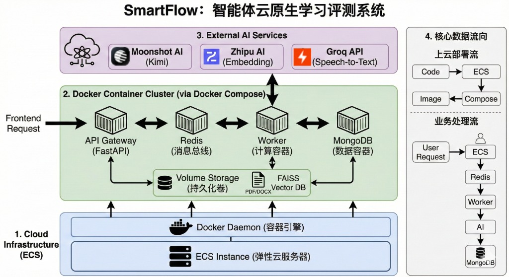
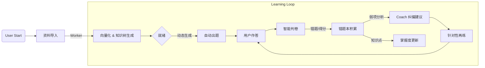

# 智能体云原生学习评测系统（SmartFlow）技术报告

## 1. 摘要
本项目面向“学习效果评估与巩固”场景，解决学完新知识后缺乏客观评估、难以定位薄弱点的问题。系统以“资料导入→自动出题→智能判卷→错题与掌握度回流→再练与引导”为闭环，结合 LLM Agent 与 Check Layer，实现可用、可解释的学习评测流程。工程上采用云原生方式拆分为 API/Worker/数据库/队列等服务，通过 Docker Compose 统一编排，并使用 MongoDB 与 Redis 实现持久化记忆与异步任务。在多模态输入（PDF/DOCX/音频转写）的基础上，系统生成题目与解析、记录错题并提供 Tutor 引导和 Coach 纠偏建议，最终形成“评测—纠偏—巩固”的学习闭环。

## 2. 核心痛点与需求分析

### 2.1 痛点场景定义
在学习者完成新知识的初步摄入后，往往面临三大痛点，导致知识内化效率低：
1.  **"评估缺失"**：缺少即时、客观的检测手段，学习者难以确认自己是否真正掌握了知识点。
2.  **"盲点隐形"**：错误往往被忽略，无法像考试一样暴露知识盲区，导致复习缺乏针对性。
3.  **"纠偏滞后"**：缺乏“助教”角色的即时反馈，错题难以转化为深度理解，无法形成闭环。

### 2.2 系统目标
本项目旨在构建 **SmartFlow 智能体云原生评测系统**，实现 **"学-测-判-纠-练"** 的全链路闭环。
*   **输入多样化**：支持 PDF 教材、DOCX 笔记及课程录音（ASR 转写）作为知识源。
*   **评估智能化**：利用 LLM 根据资料动态生成不同难度的题目（选择/填空/简答），并提供基于知识点的深度解析。
*   **反馈个性化**：自动聚合用户的薄弱知识点，形成动态"错题本"，并由 AI Coach 生成针对性的复习计划。

### 2.3 亮点与扩展功能 (Beyond Requirements)
相较于基础的大作业要求，本系统在以下方面进行了功能扩展与深度优化：
1.  **知识体系可视化**：不局限于单次出题，而是自动从资料中抽取“章-节-点”树状结构，并以 ECharts 可视化展示，支持按章节定向测验。
2.  **动态掌握度画像**：建立了红/黄/绿三色掌握度模型，根据做题结果实时更新知识点状态，直观暴露薄弱环节。
3.  **Tutor & Coach 双重辅助**：
    *   **Tutor（助教）**：在做题时提供苏格拉底式引导，而非直接给出答案。
    *   **Coach（教练）**：在课后基于错题历史生成针对性的复习计划（小灶）。
4.  **鲁棒的 Check Layer**：构建了独立的校验层，不仅检测 LLM 输出格式，还能进行自动重试与修复，显著提升了系统的稳定性。

## 3. 系统架构设计（云原生）
### 3.1 架构图


### 3.2 云原生组件说明
- Docker & Dockerfile：后端/Worker/前端统一容器化，保证环境一致与可迁移  
- Docker Compose：一键编排 API、Worker、Redis、MongoDB、Frontend 等多服务  
- API 服务（FastAPI）：无状态 Web 服务，负责请求、参数校验与任务投递  
- Worker/RQ：承载 LLM 出题/判卷/知识树生成等重任务，避免阻塞 API  
- Redis：任务队列与短期缓存，支撑异步流水线  
- MongoDB：持久化存储材料、题目、作答、错题与掌握度  
- 原始文件存储：本地 volume（开发）/OSS（云端），保存 PDF/DOCX/音频  
- 向量索引（本地/可扩展）：轻量级向量检索保存于 volume，后续可替换为 Redis-Vector  
- 外部模型服务：Kimi（文档抽取/出题/判卷）、Groq（ASR）、Embedding API（RAG）

### 3.3 数据流向
### 3.3 数据流向与云服务调用逻辑
1.  **资料处理流 (Ingestion Pipeline)**:
    - 用户上传 PDF/DOCX 到 **API**。
    - API 保存文件至本地存储 (Storage)，并将任务 ID 压入 **Redis** 队列。
    - **Worker** 从 Redis 获取任务，读取文件，进行文本清洗与切分 (Chunking)。
    - Worker 调用 **Zhipu API** 将文本块转化为向量 (Embedding)，并存储于本地 FAISS 索引 (Storage)。
    - 同时调用 **Moonshot API** 进行知识点抽取，生成知识体系树，存入 **MongoDB**。
2.  **出题与判卷流 (Quiz & Grade Pipeline)**:
    - 用户发起出题请求，**API** 根据请求参数组装 Prompt，若包含 RAG 需求则先检索向量库。
    - 请求入队，**Worker** 调用 **Moonshot API** 生成题目（JSON 格式），存入 **MongoDB**。
    - 用户作答后提交，**Worker** 调用 **Moonshot API** 进行判分与解析，结果回写数据库，并更新用户的掌握度 (Mastery) 状态。
3.  **交互与纠偏流 (Chat & Tutor Pipeline)**:
    - **Tutor/Coach** 功能通过 API 直接响应或异步处理，基于用户历史错题 (MongoDB) 与当前对话上下文，调用 **Moonshot API** 生成引导式回复。
    - 若涉及具体知识点查询，Worker 会再次调用 **Zhipu API** 向量化 Query 并检索本地 FAISS 索引 (RAG)，增强回复准确性。

## 4. 业务流程与功能闭环

### 4.1 功能闭环流程图


### 4.2 出题逻辑 (Dynamic Quiz Generation)
系统摒弃了传统的静态题库，完全基于上传资料实时生成，保证了题目的时效性与贴合度。
*   **输入**：Text Chunk（教材片段） + Difficulty (L1/L2/L3) + Question Type (MCQ/Short)。
*   **处理**：RAG 检索相关上下文 $\rightarrow$ 组装 Prompt $\rightarrow$ LLM 生成 JSON $\rightarrow$ 格式校验。
*   **输出**：结构化题目（包含 `stem`, `options`, `answer_key`, `analysis`, `knowledge_points`）。

### 4.3 智能判卷逻辑 (Intelligent Grading)
针对不同题型采用分级策略：
*   **客观题 (MCQ/Blank)**：采用 **规则匹配 + LLM 纠错** 双重机制。优先进行关键词/选项匹配；若匹配失败（如大小写差异、同义词），调用 LLM 判断语义是否一致，极大降低误判率。
*   **主观题 (Short Answer)**：采用 **Rubric Evaluation** 模式。LLM 扮演阅卷老师，依据评分标准从 `correctness`, `completeness`, `reasoning` 三个维度打分（0-1），加权计算总分。

## 5. 智能体策略与 Prompt 设计

### 5.1 Agent 体系
我们设计了多 Agents 协作体系，专职专能，避免单一大模型的指令混淆。

| Agent 名称 | 核心职责 | Model | 使用工具 |
| :--- | :--- | :--- | :--- |
| **Quiz Agent** | 基于文本生成符合 JSON Schema 的题目 | moonshot-v1-8k | RAG Retrieval |
| **Grade Agent** | 对比标准答案进行多维评分与解析 | moonshot-v1-8k | Rubric Evaluation |
| **Coach Agent** | 分析错题模式，生成个性化学习建议 | moonshot-v1-8k | Mistake History |
| **Tutor Agent** | 苏格拉底式教学，引导而不直接给答案 | moonshot-v1-8k | Conversation Memory |

### 5.2 关键 Prompt 模板设计
(以下展示简化版核心 Prompt，实际部署中包含更多 Few-Shot 示例)

#### (1) 出题 (Quiz Generator)
```text
Role: You are a quiz generator. Output JSON only.
Instruction: Based on the provided text, generate {num} questions of type {type}.
Constraints:
1. JSON structure must strictly follow: [{"stem": "...", "options": [...], "answer_key": "...", "analysis": "..."}]
2. Distractors in MCQ must be plausible but incorrect.
3. Analysis must explain WHY the answer is correct based on the text.
Context: {rag_context}
```

#### (2) 判卷 (Grading with Rubric)
```text
Role: You are a fair grader.
Task: Grade the student's answer based on the Rubric.
Input:
- Question: {question}
- Reference: {reference}
- Student Answer: {student_answer}
Scoring Criteria:
- Correctness (0.4): Is the core assertion true?
- Reason (0.3): Is the logic sound?
- Completeness (0.3): Are all points covered?
Output: JSON with {score, criteria_scores, feedback, missing_knowledge_points}
```

## 6. 幻觉控制与公平性 (The "Gate" Check Layer)

为了解决 LLM 偶尔生成“格式错误的 JSON”或“一本正经胡说八道”的问题，我们在 Agent 上游引入了 **Check Layer**（见 `worker/checkers/gate.py`）。

### 6.1 Gate 机制与自动修复流程
我们实现了一个装饰器 `run_with_checker`，它拦截 LLM 的原始输出并执行以下逻辑：
1.  **Draft**: LLM 生成初步结果（如 JSON 字符串）。
2.  **Validate**: Checker 检查语法（JSON.parse）和语义（Schema 字段完整性、取值范围）。
3.  **Refine Loop**:
    *   若通过 $\rightarrow$ 返回结果。
    *   若失败 $\rightarrow$ 将**错误堆栈**和**修正指令**（如 "You missed field `analysis`"）回传给 LLM。
    *   LLM 尝试 Self-Correction。
    *   设定最大重试次数（Max Retries = 3），防止无限死循环。

**Case Study**:
> *LLM Output (Bad)*: `{"stem": "Cloud Native is...", "answer": "A"}` (Missing "options")
> *Checker Feedback*: "Error: Missing required field 'options'. Please generate a valid JSON object."
> *LLM Output (Repaired)*: `{"stem": "Cloud Native is...", "options": ["A", "B"], "answer": "A"}` (Accepted)

### 6.2 异常熔断与降级
当重试 3 次仍失败，或者外部 API 超时（Timeout），系统触发熔断机制：
*   **出题降级**：不再重试，而是直接从备用规则库返回一道通用“保底题”（Fallback Question），保证用户端不会看到“系统错误”。
*   **判卷降级**：标记为 "Manual Review Needed"，提示用户稍后重试，避免给出错误评分。

## 7. 数据模型与持久化设计

采用 MongoDB 存储半结构化数据，灵活应对 Agent 输出结构的变化。

| 集合 (Collection) | 核心字段 | 说明 |
| :--- | :--- | :--- |
| **materials** | `_id`, `content`, `chunks`, `knowledge_tree` | 存储原始文本及抽取的知识树结构 |
| **quizzes** | `_id`, `material_id`, `questions: [{stem, options...}]` | 一次出题请求生成的试卷快照 |
| **attempts** | `_id`, `quiz_id`, `user_answers`, `score`, `grading_result` | 用户的每一次作答记录与判分详情 |
| **mistakes** | `_id`, `question_id`, `error_tag`, `count` | **错题聚合表**。记录同一题或同类知识点的错误频次 |
| **mastery** | `_id`, `user_id`, `node_status: {node_1: "red", node_2: "green"}` | 用户知识点掌握度画像 (Red/Yellow/Green) |

## 8. 工程实践与部署

### 8.1 Docker 容器化编排
项目完全遵循云原生标准，通过 `docker-compose.yml` 编排 5 个核心容器：

```yaml
services:
  backend:     # FastAPI, 开放 Port 8000
  worker:      # RQ Worker, 依赖 Redis, 无需对外 Port
  frontend:    # Vite Dev Server, 开放 Port 5173
  redis:       # 任务队列 Broker
  mongodb:     # 数据持久化
```
所有服务共享 `network_mode: bridge`，通过服务名（DNS）互相发现，无需硬编码 IP。

### 8.2 环境变量管理
敏感配置通过 `.env` 文件注入，杜绝 Key 泄露：
*   `MOONSHOT_API_KEY`: Kimi Chat 模型密钥
*   `GROQ_API_KEY`: Whisper ASR 服务密钥
*   `ZHIPU_API_KEY`: Embedding 服务密钥
*   `MONGO_URI`: 数据库连接串

### 8.3 CI/CD 与启动检查
*   **Health Check**: 后端启动时自动检查 Redis/Mongo 连接，失败则快速退出（Fail Fast）。
*   **Volume Mounting**: 开发环境挂载 `./storage` 目录，确保上传文件和向量索引在容器重启后不丢失。

## 9. 分工说明
分组：
- 架构/工程组：毛姝妍、邵乐怡
- 算法/Agent 组：欧阳诚
（说明：部分工作存在交叉，按主要负责模块统计贡献比例）

成员贡献：
- 毛姝妍（45%）：端到端闭环实现（材料入库、出题、判卷、错题本）、后端接口与数据模型、Docker/Compose 与环境配置、轻量级 RAG、判题格式校验与正确性、部分前端交互设计与联调、报告撰写。
- 欧阳诚（45%）：知识体系树与掌握度、小灶建议（Coach）、Tutor 引导及其优化、Prompt/Check Layer 设计、过程式解答优化。
- 邵乐怡（10%）：前端优化（知识树可视化/ECharts 接入、页面美化与体验优化）、报告撰写。

## 10. 演示流程与效果 (Demo)
1.  **资料上传**: 用户上传《云计算导论》PDF，Frontend 显示 "Ingesting..." 进度条，Worker 后台完成 Embedding 和知识树构建。
2.  **知识全景**: 首页展示 "知识地图"（ECharts 树图），节点颜色实时反映掌握度（初始为灰）。
3.  **智能出题**: 点击 "第一章测验"，系统流式生成 5 道 MCQ 和 1 道简答题。
4.  **判卷反馈**: 用户提交后 1s 内出分，错误题目显示 LLM 解析，并自动加入 "错题本"。
5.  **Tutor 引导**: 在错题页面点击 "我不懂"，Tutor Agent 弹出，基于错误原因进行多轮引导式问答。

## 11. 不足与改进方向
虽然系统已闭环，但仍存在以下改进空间：
1.  **RAG 深度不足**: 当前仅检索 top-k 文本块，对于跨章节的综合推理题支持有限。未来计划引入 **GraphRAG**，利用知识图谱增强推理。
2.  **多模态融合**: 目前 ASR 仅为单向输入，未来期望支持 **语音交互 (TTS)**，实现更自然的 "口语陪练"。
3.  **并发限额**: 强依赖 Moonshot API，受限于 Rate Limit。未来考虑本地部署 **Qwen2-7B** 蒸馏模型，降低成本并提高隐私性。
